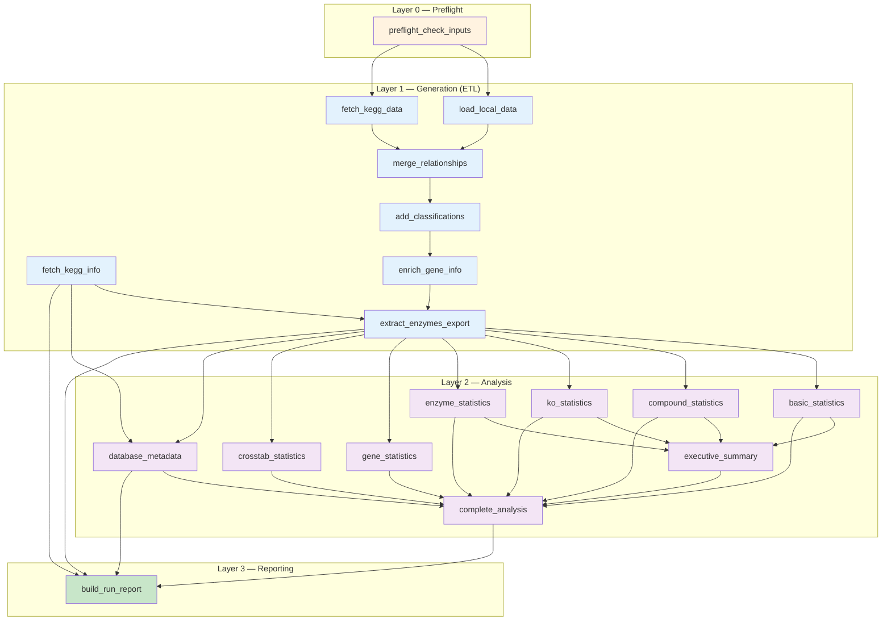

# Pipeline Architecture

This document describes the architecture of the BioRemPP Database generation pipeline, implemented as a reproducible Snakemake workflow.

---

## Architecture Overview

The BioRemPP pipeline is a **four-layer Snakemake workflow** that transforms fragmented data sources into a unified, FAIR-compliant database. The pipeline separates concerns into clearly defined stages, each implemented as independent Snakemake rule modules.

### Design Principles

- **Config-driven** — All paths, KEGG endpoints, version strings, and analysis parameters are centralized in `config/config.yaml`. No hardcoded values in scripts.
- **Single-responsibility scripts** — Each R/Python script performs exactly one transformation step, invoked via CLI arguments.
- **Decoupled from Snakemake internals** — Scripts use `--key value` CLI parsing (not `snakemake@input` syntax), making them independently testable and executable outside Snakemake.
- **Enforced contracts** — `workflow/lib/io_contracts.R` defines required input files, expected output columns, and KEGG endpoint specifications as shared constants.
- **Deterministic processing** — No stochastic components; identical inputs always produce identical outputs.

---

## Four-Layer Architecture



### Layer 0 — Preflight (`00_preflight.smk`)

**Purpose:** Input validation gate. Verifies all 6 required input files exist before any processing begins.

**Output:** `work/preflight_ok.json` — a sentinel file that gates all downstream rules.

### Layer 1 — Generation (`10_generation.smk`)

**Purpose:** ETL (Extract-Transform-Load) pipeline. Fetches data from local files and KEGG API, merges relationships, classifies compounds, enriches with gene information, extracts enzyme activities, and exports the final database.

**Key characteristics:**

- `load_local_data` and `fetch_kegg_data` run **in parallel** after preflight
- `fetch_kegg_info` runs **independently** (only needed at export time for KEGG release tracking)
- Sequential chain: merge → classify → enrich → export

### Layer 2 — Analysis (`20_analysis.smk`)

**Purpose:** Statistical analysis of the generated database. Produces 9 JSON reports covering basic metrics, compound/KO/enzyme/gene distributions, cross-tabulations, metadata, executive summary, and a consolidated analysis bundle.

**Key characteristics:**

- 6 of 7 base analysis rules are **independent** (read only the CSV) and run in parallel; `database_metadata` also reads `kegg_release.json`
- `executive_summary` depends on 4 stat files (fan-in)
- `complete_analysis` merges all 8 outputs (second fan-in)

### Layer 3 — Reporting (`90_reporting.smk`)

**Purpose:** Provenance and traceability layer. Computes SHA-256 checksums for all final artifacts, records file sizes, embeds KEGG release info, and timestamps the run.

**Output:** `results/reports/workflow_summary.json`

---

## Data Flow

### Inputs

The pipeline consumes two categories of input:

#### Local Files (6 mandatory, in `input_data/`)

| File | Content | Format |
|------|---------|--------|
| `kegglistcompounds.xlsx` | KEGG compound ID → name mapping | Excel |
| `compostos_todasagencias.xlsx` | Compound → environmental agency mapping | Excel |
| `missing_compounds_founds_curated.xlsx` | Manually curated compound-KO pairs | Excel |
| `confirm_class_CURATED.xlsx` | Compound class assignments | Excel |
| `kegglistko.txt` | KO → gene symbol + gene name (27,990 entries) | TSV |
| `enzymes_unique.txt` | 218 enzyme activity terms (one per line) | Text |

#### KEGG REST API (5 endpoints + 1 info query)

| Endpoint | Purpose |
|----------|---------|
| `link/ko/ec` | KO ↔ EC number relationships |
| `link/ko/reaction` | KO ↔ Reaction relationships |
| `link/compound/ec` | Compound ↔ EC relationships |
| `link/cpd/reaction` | Compound ↔ Reaction relationships |
| `list/cpd/` | Complete compound names |
| `info/kegg` | KEGG release version tracking |

### Intermediate Artifacts (`work/`)

All intermediates use R's binary serialization format (`.rds`) for efficient mid-pipeline data transfer:

| File | Producer | Consumer(s) |
|------|----------|-------------|
| `preflight_ok.json` | `preflight_check_inputs` | `load_local_data`, `fetch_kegg_data` |
| `local_data.rds` | `load_local_data` | `merge_relationships`, `add_classifications`, `enrich_gene_info`, `extract_enzymes_export` |
| `kegg_data.rds` | `fetch_kegg_data` | `merge_relationships` |
| `merged_compounds.rds` | `merge_relationships` | `add_classifications` |
| `classified_compounds.rds` | `add_classifications` | `enrich_gene_info` |
| `enriched_compounds.rds` | `enrich_gene_info` | `extract_enzymes_export` |

### Final Outputs (`results/`)

| Directory | Contents |
|-----------|----------|
| `results/database/` | `biorempp_database_v1.0.0.csv`, `biorempp_database_v1.0.0.xlsx` |
| `results/metadata/` | `kegg_release.json` |
| `results/analysis/` | 9 JSON statistical reports |
| `results/reports/` | `workflow_summary.json` (SHA-256 checksums, provenance) |

---

## Shared Library

### `workflow/lib/io_contracts.R`

Defines three constants shared across all generation scripts:

- **`REQUIRED_INPUT_FILES`** — The 6 files that must exist before the pipeline runs
- **`EXPECTED_DATABASE_COLUMNS`** — The 8 output columns (`cpd`, `compoundclass`, `ko`, `referenceAG`, `compoundname`, `genesymbol`, `genename`, `enzyme_activity`)
- **`KEGG_ENDPOINTS`** — Endpoint specifications (URL path, column names, separator) for the 5 KEGG REST API calls

### `workflow/lib/utils.R`

Shared utility functions used by every script:

- `load_required_packages()` — Checks and loads R packages; fails fast on missing dependencies
- `parse_cli_args()` / `require_cli_args()` — Parses `--key value` CLI arguments
- `log_message()` — Timestamped structured logging
- `ensure_parent_dir()` — Recursive directory creation
- `write_json_file()` / `read_json_file()` — JSON I/O wrappers

---

## Script Conventions

All R scripts in the pipeline follow a consistent pattern:

1. **Source shared libraries** — `source("workflow/lib/utils.R")` and optionally `io_contracts.R`
2. **Parse CLI arguments** — All I/O paths received as `--key value` pairs
3. **Structured logging** — `log_message()` for timestamped progress output
4. **Single transformation** — Each script performs exactly one data transformation
5. **Explicit output** — `saveRDS()` for intermediates, `write_json_file()` for analysis, `write_csv()`/`write_xlsx()` for final database

The single Python script (`workflow/scripts/reporting/build_run_report.py`) handles SHA-256 checksum computation, leveraging Python's `hashlib` library.

---

## Containerization

The pipeline includes a complete Docker setup in `biorempp_snakemake_version/env/`:

- **Base image:** `rocker/tidyverse:4.3` (R 4.3 with tidyverse pre-installed)
- **Additions:** Python 3, pip, build tools, Java (for xlsx support), libxml2, libcurl, openssl
- **Python deps:** `snakemake==7.32.4`, `pulp==2.7.0` (pinned in `python-requirements.txt`)
- **R packages:** `readxl`, `dplyr`, `tidyr`, `stringr`, `readr`, `jsonlite`, `writexl` (listed in `r-packages.txt`)
- **Docker Compose:** Single `snakemake` service mounting the top-level workspace as `/workspace` with `working_dir: /workspace/biorempp_snakemake_version`

See [Installation](../getting-started/installation.md) for Docker execution instructions.

---

## Parallelism Opportunities

The Snakemake DAG enables automatic parallelism:

| Opportunity | Rules | Speedup |
|-------------|-------|---------|
| Parallel data loading | `load_local_data` ∥ `fetch_kegg_data` ∥ `fetch_kegg_info` | 3× |
| Parallel analysis | 6 independent stat rules (`basic`, `compound`, `ko`, `enzyme`, `gene`, `crosstab`) + `database_metadata` | 7× |

Use `--cores N` (or `-j N`) to enable multi-core execution:

```bash
snakemake --cores 4
```

---

## Further Reading

- [Snakemake Rules Reference](snakemake-rules.md) — Detailed documentation of every rule
- [Configuration Reference](config-reference.md) — Full `config.yaml` specification
- [QC Rules](../validation/qc-rules.md) — Input validation and data quality contracts
- [Reproducibility](../validation/reproducibility.md) — How reproducibility is ensured
