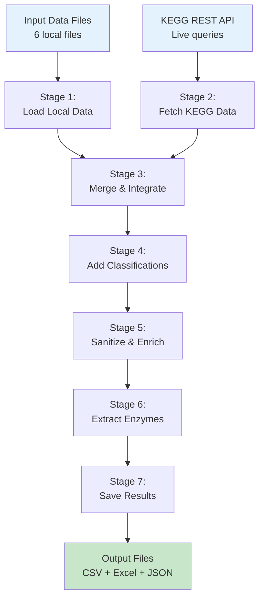

# User Guide Overview

This guide explains how to interact with the BioRemPP Database generation pipeline and interpret its outputs.

---

## Purpose of the User Guide

The User Guide provides practical instructions for researchers and bioinformaticians who need to:

- **Generate** the BioRemPP Database from source data and KEGG API
- **Understand** the data integration logic and pipeline workflow
- **Interpret** output files and database schema
- **Troubleshoot** common issues during execution
- **Customize** input data for specific research needs (advanced users)

This guide assumes you have already completed the [Installation](../getting-started/installation.md) and are familiar with basic R usage and bioinformatics concepts (KEGG identifiers, enzyme nomenclature, regulatory frameworks).

**This guide does NOT cover:**

- Installation procedures (see [Getting Started](../getting-started/installation.md))
- Technical implementation details (see [Technical Documentation](../technical/pipeline-architecture.md))
- Database schema specifications (see [Database Reference](../database/schema.md))
- Data integration workflows (see [Interoperability](../interoperability/r-integration.md))

---

## High-Level Workflow Overview

The BioRemPP Database generation pipeline follows a seven-stage workflow that transforms fragmented data sources into a unified, FAIR-compliant database:

### Typical Execution Flow

1. **User initiates pipeline** via R console, RStudio, or command line (`Rscript`)
2. **Pipeline loads** 6 local input files from `input_data/` directory
3. **Pipeline queries** KEGG REST API for compound-gene relationships (~50-100 MB data transfer)
4. **Pipeline integrates** environmental agency lists with KEGG data
5. **Pipeline enriches** data with gene information and enzyme activities
6. **Pipeline validates** and sanitizes identifiers (KEGG Compound, KEGG Orthology)
7. **Pipeline exports** final database to `output_data/` (CSV, Excel formats)
8. **User examines** output files and optionally runs statistical analysis

**Total runtime:** ~5 minutes (typical configuration with stable internet connection)

---

## Data Sources and Integration Logic

### Data Source Categories

The BioRemPP Database integrates four primary data source types:

#### 1. KEGG Database (Dynamic, API-Driven)

**Source:** KEGG REST API (https://rest.kegg.jp/)  
**Update Frequency:** Real-time during pipeline execution  
**Content:**

- KO-EC number relationships
- KO-Reaction relationships
- Compound-EC number relationships
- Compound-Reaction relationships
- Compound names and nomenclature
- Gene symbols and functional descriptions

**Integration Method:** Automated API queries with retry logic and error handling

---

#### 2. Environmental Regulatory Agencies (Curated, Static)

**Source:** Local file `input_data/compostos_todasagencias.xlsx`  
**Update Frequency:** Manual updates by BioRemPP team  
**Content:** Compound lists from 9 international agencies:

- ATSDR (Agency for Toxic Substances and Disease Registry)
- EPA (Environmental Protection Agency)
- IARC Groups 1, 2A, 2B (International Agency for Research on Cancer)
- PSL (Priority Substances List, Canada)
- EPC (Environmental Priority Chemicals, Europe)
- WFD (Water Framework Directive, EU)
- CONAMA (Brazilian National Environment Council)

**Integration Method:** Cross-referencing KEGG Compound IDs with agency classification lists

---

#### 3. Manual Expert Curations (Curated, Static)

**Source:** Local file `input_data/missing_compounds_founds_curated.xlsx`  
**Update Frequency:** Manual updates by domain experts  
**Content:** Gap-filling for compound-KO relationships not captured by automated KEGG API extraction

**Integration Method:** Direct inclusion after validation against literature

---

#### 4. Enzyme Activity Lexicon (Curated, Static)

**Source:** Local file `input_data/enzymes_unique.txt`  
**Update Frequency:** Manual updates based on systematic literature review  
**Content:** 210+ standardized enzyme activity terms (e.g., "dioxygenase", "cytochrome P450", "dehydrogenase")

**Integration Method:** Pattern matching against KEGG gene names using regular expressions

---

### Integration Logic

The pipeline applies the following logic to combine data sources:

1. **Start with regulatory compounds** (environmental agency lists) as the foundation
2. **Map to KEGG identifiers** using Compound ID cross-references
3. **Retrieve functional relationships** from KEGG API (KO-EC, KO-Reaction, Compound-EC, Compound-Reaction)
4. **Merge compound-KO pairs** from both API queries and manual curations
5. **Enrich with gene information** by joining KO identifiers to KEGG gene annotations
6. **Classify compounds** using manually curated chemical classifications
7. **Extract enzyme activities** by pattern matching against standardized enzyme lexicon
8. **Validate and sanitize** all identifiers to ensure KEGG format compliance (C#####, K#####)

**Design principle:** Integrate authoritative sources (KEGG, regulatory agencies) with expert curation to maximize coverage and accuracy.

---

## User Interaction Model

### What Users Control

Users have control over the following aspects:

#### Input Data Customization (Advanced)

- **Environmental agency lists** (`compostos_todasagencias.xlsx`) — Add/remove compounds or agencies
- **Manual curations** (`missing_compounds_founds_curated.xlsx`) — Add compound-KO relationships from literature
- **Chemical classifications** (`confirm_class_CURATED.xlsx`) — Modify compound class assignments
- **Enzyme lexicon** (`enzymes_unique.txt`) — Add specialized enzyme terms

!!! warning "Modifying Input Files"
    Changing input files affects database content and may introduce inconsistencies. Advanced users should document modifications and validate outputs.

#### Execution Parameters

- **Working directory** — Pipeline location determines where outputs are saved
- **R session settings** — Memory limits, timeout values, locale configurations

---

### What is Fixed (Pipeline-Controlled)

The following are determined by the pipeline and **cannot** be modified without editing source code:

#### Data Transformation Logic

- KEGG API query endpoints and parameters
- Data merging algorithms (EC-based, Reaction-based)
- Identifier sanitization rules (regex patterns for K#####, C#####)
- Enzyme activity extraction patterns
- Field completeness validation

#### Output Schema

- 8-column database structure (cpd, compoundclass, ko, referenceAG, compoundname, genesymbol, genename, enzyme_activity)
- CSV and Excel file formats
- File naming conventions (`biorempp_database_v1.0.0.*`)

#### Quality Control

- Removal of entries with missing gene symbols or names
- Deduplication of compound-KO relationships
- Standardization of KEGG identifier formats

**Design principle:** Automated decisions ensure consistency and reproducibility; curated inputs allow domain expertise integration.

---

## Typical Use Scenarios

### Scenario 1: Standard Database Generation

**User goal:** Generate the complete BioRemPP Database using default settings

**Steps:**

1. Ensure [Requirements](../getting-started/requirements.md) are met
2. Clone repository and navigate to the project root directory
3. Execute `source("generate_database.R")` in R
4. Wait ~5 minutes for completion
5. Examine output files in `output_data/`

**Outcome:** Standard database with 10,869 entries, 100% field completeness

**Detailed instructions:** [Quick Start Guide](../getting-started/quick-start.md)

---

### Scenario 2: Custom Compound List Integration

**User goal:** Add institution-specific priority compounds not in default agency lists

**Steps:**

1. Identify KEGG Compound IDs for new compounds (https://www.kegg.jp/kegg/compound/)
2. Edit `input_data/compostos_todasagencias.xlsx`:
   - Add rows with compound IDs and agency reference (e.g., "CUSTOM")
3. Re-run pipeline
4. Verify new compounds appear in output

**Outcome:** Expanded database including custom compounds with automated KEGG annotation

**Detailed instructions:** [Input Data Files](input-data.md)

---

### Scenario 3: Literature-Based Curation

**User goal:** Add newly published compound-gene relationships from recent literature

**Steps:**

1. Identify compound (KEGG Compound ID) and gene (KEGG Orthology ID) from paper
2. Edit `input_data/missing_compounds_founds_curated.xlsx`:
   - Add row with cpd and ko columns
3. Document source (paper DOI) in comments or separate log
4. Re-run pipeline
5. Validate inclusion in final database

**Outcome:** Database includes literature-derived relationships not yet in KEGG

**Detailed instructions:** [Input Data Files](input-data.md)

---

### Scenario 4: Automated Analysis and Reporting

**User goal:** Generate statistical summaries and metadata for reporting

**Steps:**

1. Generate database using standard workflow
2. Navigate to `analysis/` directory
3. Execute `source("analyze_database.R")`
4. Examine 9 JSON files in `analysis/output/`

**Outcome:** Comprehensive statistics (metadata, basic stats, compound/KO/enzyme/gene analysis, cross-tabulations, executive summary)

**Detailed instructions:** [Understanding Output](understanding-output.md)

---

### Scenario 5: Multi-Omics Integration (External Workflow)

**User goal:** Annotate metagenomic dataset with bioremediation potential

**Steps:**

1. Generate BioRemPP Database
2. Perform functional annotation of metagenome (e.g., HUMAnN3, DRAM) to obtain KO lists
3. Load BioRemPP Database in R or Python
4. Join detected KO identifiers with database entries
5. Summarize bioremediation-relevant genes and compounds

**Outcome:** Annotated metagenome with biodegradation pathway information

**Detailed instructions:** [Multi-Omics Workflows](../interoperability/multi-omics.md)

---

## Detailed Sections of the Guide

This User Guide is organized into the following sections:

### [Running the Pipeline](running-pipeline.md)

Complete instructions for executing the database generation workflow, including:

- Execution methods (RStudio, R console, command line)
- Monitoring pipeline progress
- Interpreting console output and log messages
- Execution time expectations
- Stopping and resuming runs

---

### [Input Data Files](input-data.md)

Detailed descriptions of the 6 required input files:

- File specifications (format, schema, size)
- Data provenance and update protocols
- Guidelines for safe customization
- Validation procedures

---

### [Understanding Output](understanding-output.md)

Comprehensive guide to pipeline outputs:

- Database file formats (CSV, Excel)
- Schema documentation (8 columns)
- Analysis outputs (9 JSON statistics files)
- Output validation and quality checks
- Common output patterns and interpretations

---

### [Troubleshooting](troubleshooting.md)

Solutions to common issues:

- KEGG API connection failures
- Memory and performance problems
- Data validation errors
- Output file generation issues
- Platform-specific problems (Windows, macOS, Linux)

---

## Next Steps

After understanding this overview:

2. **Examine outputs:** Read [Understanding Output](understanding-output.md) to interpret results
3. **Integrate data:** See [Interoperability](../interoperability/r-integration.md) for usage examples
4. **Explore database:** Consult [Database Reference](../database/schema.md) for schema details

---

## Questions?

**GitHub Issues:** [https://github.com/BioRemPP/biorempp_db/issues](https://github.com/BioRemPP/biorempp_db/issues)  
**Email:** biorempp@gmail.com
