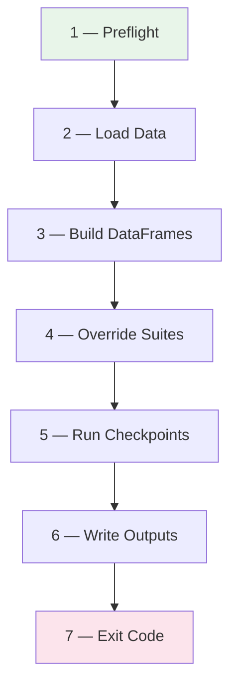

# Validation Module Architecture

The **biorempp_validation** module is an independent, post-pipeline validation
tool that verifies BioRemPP Snakemake outputs using
[Great Expectations](https://greatexpectations.io/) (GX).  It is a read-only
consumer of the Snakemake results — it never modifies upstream data.

| Property | Value |
|----------|-------|
| Package name | `biorempp-validation` |
| Version | 1.0.0 |
| Python | ≥ 3.10 |
| GX version | ≥ 1.12, &lt; 1.13 |
| Layout | `src`-layout (`src/biorempp_validation/`) |

---

## Module Inventory

The package contains **8 source modules** (inside `src/biorempp_validation/`):

| Module | Lines | Responsibility |
|--------|------:|----------------|
| `run_validation.py` | 353 | **Orchestrator / CLI entry-point.** Drives the entire validation flow from preflight to exit-code. |
| `json_to_dataframe.py` | 405 | Flattens 9 analysis JSON payloads into single-row pandas DataFrames for GX validation. Contains private helpers that replicate Snakemake analysis logic for bit-for-bit reproducibility checks. |
| `settings.py` | 68 | YAML → frozen `ValidationSettings` dataclass. All config fields are immutable after load. |
| `consistency_checks.py` | 56 | Cross-validates 12 metrics between the CSV database and `basic_statistics.json`. |
| `report_builder.py` | 56 | Post-run: extracts failed expectations from both checkpoints and builds `validation_summary.json` with a 3-tier recommendation. |
| `gx_context.py` | 44 | Thin wrapper around the GX API — creates an **ephemeral** context, registers a pandas datasource, and runs suites on DataFrames. |
| `loaders.py` | 42 | Pure I/O layer — resolves file paths, detects missing files, loads CSV and JSON. |
| `__init__.py` | 5 | Package marker. Exports `__version__` and `__all__`. |

A root-level `__init__.py` shim appends the `src/biorempp_validation` directory
to `__path__` so the module can be invoked with `python -m` without installation.

---

## Data Flow

The validation pipeline follows a linear, 7-stage flow:



### Stage details

| # | Stage | What happens |
|---|-------|-------------|
| 1 | **Preflight** | Resolves 11 required file paths against `input_results_root`. If any file is missing → writes a synthetic critical-failure JSON and exits with code `1`. |
| 2 | **Load Data** | Reads the CSV database (`load_database_csv`), 9 analysis JSONs (`load_analysis_payloads`), and KEGG metadata (`load_json`). |
| 3 | **Build DataFrames** | Constructs 6 pandas DataFrames — one per validation target: `database_csv`, `analysis_critical`, `analysis_warning`, `analysis_exact`, `metadata_kegg`, `cross_consistency`. |
| 4 | **Override Suites** | Loads 7 expectation-suite JSON files and mutates them in-place, injecting column lists, value sets, and drift thresholds from the config. When `strict_exact: true`, drift thresholds are pinned to observed values (`min == max == actual`). |
| 5 | **Run Checkpoints** | Creates an ephemeral GX context and pandas datasource. Runs two checkpoints in sequence: **critical_gate** (5 suites, hard-fail) → **warning_report** (2 suites, advisory). |
| 6 | **Write Outputs** | Writes 3 JSON files to `output_dir` (always) + an optional `data_docs/index.html` page. |
| 7 | **Exit Code** | `0` if all relevant checks pass. `1` if a critical failure occurs (and `fail_on_critical: true`) or a warning failure occurs (and `fail_on_warning: true`). |

---

## Entry Points

There are two equivalent ways to invoke the validator:

**CLI entry-point** (registered in `pyproject.toml`):

```bash
biorempp-validate --config biorempp_validation/config/validation.yaml
```

**Module invocation** (via root-level `__path__` shim):

```bash
python -m biorempp_validation.run_validation --config biorempp_validation/config/validation.yaml
```

Both call `main(argv)` → `parse_args()` → `load_settings()` → `run(settings)`.

---

## Output Artifacts

| File | Condition | Content |
|------|-----------|---------|
| `critical_checkpoint_result.json` | Always | Full GX result payload for the 5 critical suites. |
| `warning_checkpoint_result.json` | Always | Full GX result payload for the 2 warning suites. |
| `validation_summary.json` | Always | Aggregated summary with pass/fail status, failure counts, failed expectation details, and a human-readable recommendation. |
| `data_docs/index.html` | Only when `generate_data_docs: true` | Lightweight HTML summary page. |

---

## Design Decisions

### Ephemeral GX context

The module uses `gx.get_context(mode="ephemeral")` — no persistent
`.great_expectations/` project folder, no stores, no file-backed data docs.
The GX context is created and destroyed within a single `run()` invocation.
This keeps the validation fully self-contained and avoids side-effects between
runs.

### Config-driven validation

All domain vocabularies (agencies, compound classes), column schemas, drift
thresholds, and file paths are defined in `validation.yaml` and injected into
the expectation-suite JSON at runtime via `_apply_config_overrides_to_suite_payloads()`.
This means **no expectation suite needs to be edited manually** when the data
contract changes — only the YAML config is updated.

### Frozen settings

`ValidationSettings` is a frozen dataclass (`@dataclass(frozen=True)`), making
the configuration immutable after construction.  This prevents accidental
mutation during the validation run.

### Read-only consumer

The validation module never writes to or modifies the Snakemake results
directory.  All outputs go to its own `output_dir`.

---

## Dependencies

| Package | Version | Purpose |
|---------|---------|---------|
| `great_expectations` | ≥ 1.12, &lt; 1.13 | Validation framework (ephemeral context, suites, batches) |
| `pandas` | ≥ 2.0, &lt; 3.0 | DataFrame operations for data loading and transformation |
| `PyYAML` | ≥ 6.0, &lt; 7.0 | YAML configuration parsing |
| `jsonschema` | ≥ 4.0, &lt; 5.0 | JSON schema validation support |
| `pytest` | ≥ 8.0, &lt; 9.0 | Testing framework (dev-only) |

---

## Relationship to the Snakemake Pipeline

```
Snakemake Pipeline                     biorempp_validation
┌──────────────────────┐              ┌──────────────────────┐
│  18 rules            │  produces    │  reads (read-only)   │
│  R scripts + Docker  │ ──────────► │  Python + GX         │
│                      │  results/   │                      │
│  output:             │             │  validates:          │
│  ├─ database/*.csv   │             │  ├─ schema & nulls   │
│  ├─ analysis/*.json  │             │  ├─ reproducibility  │
│  └─ metadata/*.json  │             │  ├─ cross-consistency│
└──────────────────────┘             │  └─ domain contracts │
                                     │                      │
                                     │  output:             │
                                     │  ├─ *_result.json    │
                                     │  ├─ summary.json     │
                                     │  └─ data_docs/       │
                                     └──────────────────────┘
```

The Snakemake pipeline generates the database and analysis artifacts.
The validation module independently verifies those artifacts against formal
contracts, then reports pass/fail status.  The two systems share no code —
they communicate exclusively through the file system.
