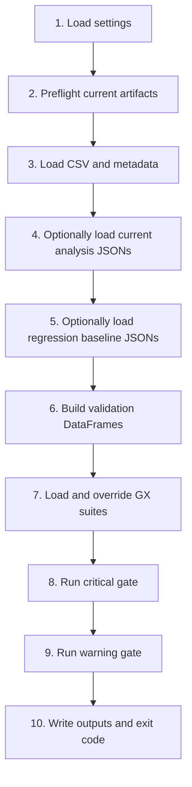

# Validation Module Architecture

`biorempp_validation` is a read-only post-pipeline validator for BioRemPP
outputs. It consumes the Snakemake results directory, rebuilds validation
datasets in memory, runs Great Expectations suites, and writes a structured
summary.

## Runtime Shape

| Property | Value |
|----------|-------|
| Package name | `biorempp-validation` |
| Version | `1.1.0` |
| Python | `>=3.10` |
| Layout | `src/biorempp_validation/` |
| Canonical entrypoint | `biorempp-validate` |
| Canonical runtime | Docker service `validation` |

The package is installed into the container image. Runtime execution no longer
depends on a root-level import shim or on `python -m biorempp_validation.run_validation`.

## Source Modules

The package currently consists of these modules under `src/biorempp_validation/`:

| Module | Responsibility |
|--------|----------------|
| `run_validation.py` | Orchestrator and CLI entrypoint. |
| `settings.py` | YAML loader and immutable settings dataclasses. |
| `loaders.py` | Path resolution and file I/O helpers. |
| `gx_context.py` | Great Expectations ephemeral context and datasource setup. |
| `json_to_dataframe.py` | Recomputes analysis metrics into exact-match DataFrames. |
| `consistency_checks.py` | Cross-consistency DataFrame builder. |
| `report_builder.py` | Builds `validation_summary.json`. |
| `__init__.py` | Package marker and version export. |

## Validation Flow



## Mode-Aware Exact Checks

The key architectural change in `1.1.0` is the split of the old monolithic
strict behavior into two explicit critical paths:

- `analysis_json_internal_consistency_critical`
- `analysis_json_regression_critical`

Both reuse `build_analysis_exact_df()`, but they compare against different
targets:

- internal consistency compares the current CSV with the current run's analysis
  JSON artifacts
- regression detection compares the current CSV with the committed baseline
  snapshot

This removes the old self-referential regression behavior.

## Runtime Suite Overrides

Expectation JSON files are templates. `run_validation.py` mutates them at
runtime to inject:

- ordered column lists from `database_contract.expected_columns`
- vocabularies from `expected_reference_agencies` and
  `expected_compound_classes`
- warning drift ranges from `drift_thresholds`
- the exact expected column count for `analysis_json_critical`

The code does not auto-pin drift thresholds from the current run.

## Outputs

The validator always writes:

- `results/critical_checkpoint_result.json`
- `results/warning_checkpoint_result.json`
- `results/validation_summary.json`

If `policy.generate_data_docs` is enabled, it also writes:

- `results/data_docs/index.html`

## Canonical Execution

Run validation via Docker:

```bash
docker compose -f biorempp_snakemake_version/env/docker-compose.yml run --rm validation
```

The service executes:

```bash
biorempp-validate --config biorempp_validation/config/validation.yaml
```

That is the supported interface for both local runs and CI.
