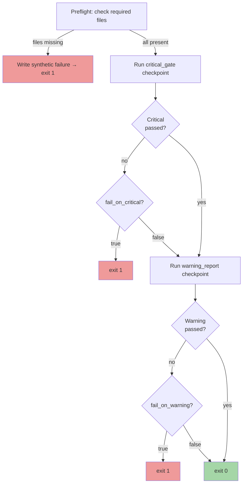

# Severity Policy

The validation module uses a **hybrid severity model** with two checkpoint
gates and configurable policy flags that control whether failures block the
pipeline.

---

## Checkpoints

Two checkpoint files orchestrate the 7 expectation suites:

### `critical_gate` — Hard Gate

| Suite | Dataset | Expectations |
|-------|---------|-------------:|
| `database_critical` | `database_csv` | 13 |
| `analysis_json_critical` | `analysis_critical` | 14 |
| `analysis_json_exact_critical` | `analysis_exact` | 16 |
| `metadata_kegg_critical` | `metadata_kegg` | 9 |
| `cross_consistency_critical` | `cross_consistency` | 5 |
| **Total** | | **57** |

Any single failure in this checkpoint constitutes a **data-contract
violation** — the database or its analysis artifacts are structurally or
semantically incorrect.

### `warning_report` — Advisory Gate

| Suite | Dataset | Expectations |
|-------|---------|-------------:|
| `database_warning` | `database_csv` | 8 |
| `analysis_json_warning` | `analysis_warning` | 6 |
| **Total** | | **14** |

Failures in this checkpoint indicate **drift** — the data is structurally
valid but some cardinality or vocabulary metric has shifted beyond expected
bounds.  Whether this blocks the pipeline is configurable.

---

## Policy Flags

Three policy flags in `validation.yaml` control the validation behaviour:

| Flag | Code Default | Config Value | Effect |
|------|:------------:|:------------:|--------|
| `fail_on_critical` | `True` | `true` | Exit `1` when any critical expectation fails |
| `fail_on_warning` | `False` | `true` | Exit `1` when any warning expectation fails |
| `generate_data_docs` | `True` | `true` | Write `data_docs/index.html` summary page |

!!! note "Code defaults vs. config values"
    The code defaults (`settings.py`) are fallbacks used only when a key is
    absent from the YAML.  In practice, the shipped `validation.yaml` sets all
    three to `true`, so both critical and warning failures block by default.

---

## `strict_exact` Mode

| Setting | Code Default | Config Value |
|---------|:------------:|:------------:|
| `strict_exact` | `False` | `true` |

When **`strict_exact: true`** (the default configuration):

- The `drift_thresholds` ranges in the YAML config are **ignored**.
- Instead, thresholds are **pinned to the actual observed values** from the
  analysis JSON payloads — e.g., if `unique_compounds` is 384, the expectation
  becomes `min == max == 384`.
- This converts all warning-level drift bands into **exact-match assertions**.
- Any change in cardinality — even by a single row — triggers a warning failure.

When **`strict_exact: false`**:

- The wider `drift_thresholds` from config are used (e.g., `unique_compounds`:
  250–700, `row_count`: 7,000–20,000).
- Minor fluctuations within the band are tolerated.

!!! tip "When to use each mode"
    Use `strict_exact: true` (default) for **release validation** — ensures
    the database is identical to the expected baseline.  Use
    `strict_exact: false` for **development** when iterating on the pipeline
    with evolving KEGG data.

---

## Exit Code Logic

The exit code is determined at the end of the `run()` function:

```python
if settings.fail_on_critical and not critical_payload.get("success", False):
    return 1
if settings.fail_on_warning and not warning_payload.get("success", False):
    return 1
return 0
```

Critical failures are evaluated first.  The full decision matrix:

| Critical Result | Warning Result | `fail_on_critical` | `fail_on_warning` | Exit Code |
|:---------------:|:--------------:|:-------------------:|:-----------------:|:---------:|
| Pass | Pass | any | any | **0** |
| **Fail** | any | `true` | any | **1** |
| **Fail** | any | `false` | any | **0** |
| Pass | **Fail** | any | `true` | **1** |
| Pass | **Fail** | any | `false` | **0** |
| Missing files | — | — | — | **1** |

The **missing files** case is handled separately during preflight — the module
writes a synthetic critical-failure payload to `critical_checkpoint_result.json`
and exits with code `1` before GX even runs.

---

## Decision Flow



---

## Validation Summary Report

After both checkpoints run, `report_builder.py` generates
`validation_summary.json` containing:

| Field | Description |
|-------|-------------|
| `run_timestamp_utc` | ISO 8601 UTC timestamp of the validation run |
| `critical_checkpoint_success` | `true` / `false` |
| `warning_checkpoint_success` | `true` / `false` |
| `counts.critical_failed_expectations` | Number of critical failures |
| `counts.warning_failed_expectations` | Number of warning failures |
| `failed_expectations` | Array of objects with `severity`, `suite`, `dataset`, `expectation_type`, `kwargs` |
| `recommendation` | Human-readable action item (see below) |

### 3-Tier Recommendation

The recommendation text follows a strict priority:

| Priority | Condition | Recommendation |
|:--------:|-----------|----------------|
| 1 | Any critical failure | *"Critical expectations failed. Block release and fix data contract violations before publishing."* |
| 2 | Warning failures only | *"No critical failures. Review warning-level drift and decide whether to recalibrate thresholds."* |
| 3 | All pass | *"All critical and warning expectations passed."* |
